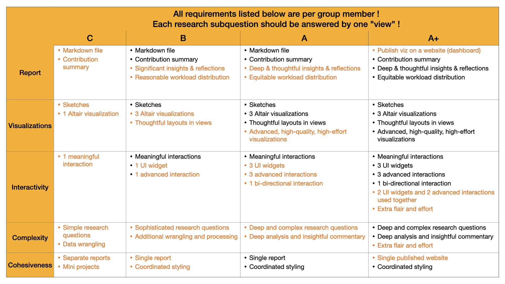

# Introduction

One of the best parts of Data Science is that after learning just a little bit of background, your world will open up drastically and you now have the power to explore whole datasets and answer some really interesting questions based on your visualization skills!
It's a whole new world...

<iframe src="https://giphy.com/embed/11thnyggFkrmmc" width="480" height="270" frameBorder="0" class="giphy-embed" allowFullScreen></iframe><p><a href="https://giphy.com/gifs/moments-part-11thnyggFkrmmc">via GIPHY</a></p>

You can find a dataset about something that you're passionate about like climate change, music, financial information, vacation rentals, flight prices, stock prices, population data, vaccine efficacy, etc...
Then practice using the techniques from this course on this dataset, and start exploring interesting questions, as well as more advanced data science techniques.
Research shows that intrinsic motivation (defined below) have significant effects in students being more genuinely engaged in the learning activities, more dedicated to the task achieving deeper learning, and more persistent in the face of learning challenges {cite}`Vansteenkiste2004`.
**The goal of this project is to hone and iterate on your visualization skills**.

```{tip}
Definition: "Intrinsic motivation refers to people’s spontaneous tendencies to be curious and interested, to seek out challenges and to exercise and develop their skills and knowledge, even in the absence of operationally separable rewards".{cite}`Domenico2017`.
```

## Project Deliverables

By the end of the project (and the 4 milestones), you will deliver:

- 3 candidate datasets and associated sketch of research questions for approval by the teaching team (one will be selected for your project)
- Data Abstraction, Exploratory Data Analysis, Task Abstraction (Stasko's taxonomy)
- Hand/Tablet-drawn sketches of visualizations
- Several static Altair visualizations
- Several interactive Altair visualizations with links and multiple views
- "Altair Dashboard" in the form of a Jupyter Notebook
- A reflection on what feedback you received, and how you incorporated that feedback. 
- Communicate the final project and results through an in-class presentation and demo video.

## Technical Requirements

### Visualizations

For this project, visualizations must
- Be created using Altair
- Not use dashboard generation tools for the final product. E.g., no Tableau Web Player, R Shiny, Plotly Dash.
- Be usable with the latest version of Chrome.

### Programming and Wrangling

All data wrangling for this project must be done in a reproducible way using Python and Pandas.
In addition, you must have:
- Clear, well-commented, and well-structured code.
- Comments provide information not present in the code itself and can help organize the code.
- Proper and consistent indentation. Code inside a block is indented more than outside it.
- Code is organized in short, reusable functions and there is little to no code duplication. If needed, functions can be moved into a separate `.py` file that should be imported

### Version Control

All projects must use a GitHub repository (a template will be provided to you after Project Milestone 1).
  
## Logistics

We will do an activity in class to help you formulate your groups.

### Group Size

The optimal group size for this project is a group of 3 or 4.
I encourage you to work in a group, and I expect that you will learn a lot more working collaboratively, including how to use `Git` and `GitHub` in a team setting.
This will be an excellent skill to put on your CV, and it will also be much closer to what happens in real life.
<!-- In **very rare cases**, individual groups will be permitted, by request only and by arrangement with the instructor. -->

## Contracts for the Project

As I mentioned in class, we will be doing Contract Grading for our DSCI 320 project.
I will commit that to ensuring that the levels will stay fairly constant, but I'll continue to add clarifications as needed.

All projects must clearly show proficiency in creating effective data visualizations as well as other course learning outcomes.
The factors that will differentiate students between the different levels are mostly related to the scope and scale of the work done.
Each grade level will have specifications on five categories: report, visualizations, interactivity, complexity, and cohesiveness.

### Contract for a `C` project (63%)

In addition to the requirements for each milestone completed at a **satisfactory standard**, these are the minimum requirements **all** projects need to meet.

#### Report

Reports must be written with [Markdown](https://www.markdownguide.org/basic-syntax/)
  - using clear and concise language with no spelling errors or typos that detract from the overall message of your writing
  - with all required elements (from each of the milestones) present and accounted for, with all sections present and meeting the minimum word counts
-  all views (multiple Altair visualizations) exported as high-resolution images and embedded into the report as images 

Each group member must also provide a detailed summary of their contributions to the project and the approximate split of the work done. 
For example the MDR team for Milestone 2 would report the workload distribution as: Mark S (40%), Dylan (15%), Irving (25%), Helly R. (20%).
Then, each team member would provide a one (long) sentence summary of their contributions to the project.

#### Visualizations

- Low-fidelity sketches must meet the following specifications:
  - Hand-drawn or digitally created using a paint/drawing program (i.e. not created using code)
  - Rough and swift
  - Avoids unnecessary details
  - Focus only on essential elements for clarity
  - Must be created **before** the high-fidelity visualizations
  - Signed and dated in the bottom right corner (for example, "Sketched by FirasM on Feb 18, 2025")
- High-fidelity Altair visualizations must meet the following specifications:
  - Clear and informative titles and redundant labels or titles removed
  - Useful legends with direct labels when appropriate
  - Appropriate aspect ratios (i.e. not too stretched or squished)
  - Coherent, logical, and sensible layouts
  - Font sizes of all plot elements (titles, labels, ticks, tick labels, headers, etc...) should match the overall size of the visualization so it's all legible
  - Appropriate use of marks, channels, and visualization types
  - Appropriate use of colour
- One visualization per group member (3 or 4, depending on group size)

#### Interactivity

- At least 1 visualization (per team member) that has a meaningful interactive component with the following characteristics: 
  - A mouse-based interaction _(e.g., hover, click, drag, tooltip, scrollytelling)_
  - The interactive component must help answer a research question or explore the subset of data presented in the visualization

#### Complexity

- Simple research questions that can be answered with one or two plots in a view
- Use the GitHub.com repository provided in Milestone 2 to store all data, code, analysis, reports
- Simple data cleaning/wrangling/processing. Examples of this include:
  - Dealing with missing values
  - Update column names
  - Fixing inconsistent capitalization issues in the dataset
  - Removing unnecessary columns
  - Create new "aggregate" columns (for e.g. weighted score)
  - etc...
- Use data science practices to ensure that analysis is reproducible and auditable. For instance, using relative paths to load datasets, executing cells in order, clearly declaring all additional packages that need to be installed, etc...

#### Cohesiveness

The amount of coordination between group members to ensure visualizations are cohesive is minimal in this grade-level.
Typically, projects at this level generally look like separate mini-projects.
The minimum requirement for cohesiveness is to ensure that axes titles, labels, and descriptions are coordinated and the interpretation of the dataset is consistent.
Separate reports may be submitted by each individual group member in the same GitHub repository.

### Contract for a `B` project (75%)

In addition to the requirements for each milestone completed at a **very good standard**, to contract for a `B` project, you should do everything in the previous levels plus:

#### Report

Reports must have significant insights, reflections, and detailed summaries of processes your group went through to create the views and visualizations.

In terms of workload distribution, 80% of the work needs to be done by at least 3 team members in a 4-person team, and 80% of the work needs to be done by at least 2 team members in a 3-person team.

#### Visualizations

- Two additional visualization per group member (3 or 4, depending on group size)
- Thoughtful layouts of multiple visualizations to produce useful "views"

#### Interactivity

For the interactive visualization you create, it must also have:

- One [UI widget](https://altair-viz.github.io/user_guide/interactions/bindings_widgets.html#widget-binding) (eg. dropdown, radio button, range slider, etc...).
- One advanced interaction technique such as brushing and linking or detail views.
- The UI widget and the advanced interaction do not need to be used together at the same time.

#### Complexity

- Generation of additional data frames that are summaries or aggregated from the original dataset with some complex data cleaning/processing/wrangling
- The research questions you choose should be more sophisticated and not superficial requiring multiple visualizations to answer the research questions

#### Cohesiveness

- Group members must submit a single report with all their visualizations embedded in one file and the report should read cohesively with significant effort put into integrating all their team members' visualizations together.
- All the colours and styles for the visualizations chosen should be coordinated.

### Contract for an `A` project (88%)

In addition to the requirements for each milestone completed at an **exceptional standard**, to contract for an `A` project, you should do everything in the previous levels plus:

#### Report

Reports must go above and beyond with deep and thoughtful reflections outlining summaries of the processes your group went through to create the views and visualizations for your project.
The workload distribution of each group member must be fair and equitable (approximately even).

#### Visualizations

Some of the visualizations you create should be "advanced": high-quality, high-effort and beyond the basic built-in visualizations that can be created in Altair.

#### Interactivity

- Two additional [UI widgets](https://altair-viz.github.io/user_guide/interactions/bindings_widgets.html#widget-binding) (eg. dropdown, radio button, range slider, etc...).
- Two additional advanced interaction techniques such as brushing and linking or detail views.
- At least one view must have bi-directional linking between representations
- The UI widget and the advanced interaction do not need to be used together at the same time.

#### Complexity

- The research questions you choose should be deep and complex and questions should need several plots to answer, or generate additional sub-questions that can be answered with more data wrangling (including merging with other data sources, and calculated columns).
- Deep analysis and insightful commentary.

#### Cohesiveness

N/A

### Contract for an `A+` project (100%)

In addition to the requirements for each milestone completed at an **exceptional standard**, to contract for an `A+` project, you should do everything in the previous levels plus:

#### Report

- Publish your dashboard and visualizations on the web and make it publicly available with an open license.
  - Please ensure you use free or open-source publishing platforms for this, there is no requirement to pay to host your website!
  - [GitHub Pages](https://docs.github.com/en/pages/getting-started-with-github-pages/creating-a-github-pages-site) is the easiest way to publish your entire repository.
  - You will also need to use the `vega-embed` package as [described here](https://altair-viz.github.io/user_guide/interactions/bindings_widgets.html#) and in [this Tutorial](https://pages.github.ubc.ca/firasm/DSCI320-2024W2/notes/tutorials/12_Interaction.html#dynamic-queries).

#### Visualizations

N/A

#### Interactivity

- At least two of the UI widgets and the advanced interactions need to be used together, at the same time.
- Extra “flair” and effort to answer complex questions and allow users to explore data through an advanced interactive dashboard (come to instructor office hours for personalized advice on how to make your project an A+ project!)

#### Complexity

- Extra “flair” and effort for your project (come to instructor office hours for personalized advice on how to make your project an A+ project!)

#### Cohesiveness

N/A

## *New* Summary Table

I created a new summary table of the above information to help you see the differences between each of the contracted grades.
Note that this is just a summary of the key differences and not *all* the differences.
This table should be used as a quick lookup rather than a comprehensive breakdown.



